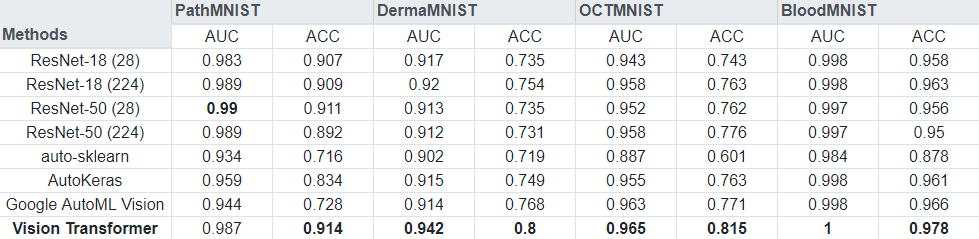
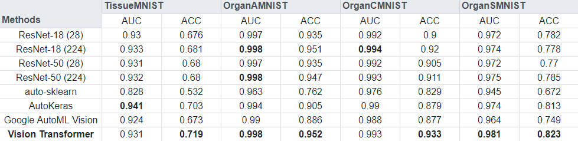
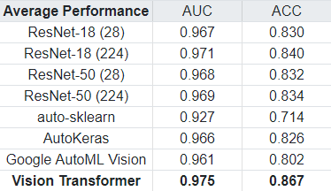

# ViT-MedMNIST - Fine-tuned Vision Transformer on MedMNIST (v2) 2D Multi-Class Datasets

[MedMNIST v2](https://medmnist.com/) is a collection of biomedical images.
There are 8 datasets with 2D images for a multi-class classification task.
The authors of the dataset collection report baseline performances with ResNets,
and with the AutoML solutions auto-sklearn, AutoKeras, and Google AutoML Vision.

Using a pre-trained [Vision Transformer model](https://huggingface.co/google/vit-base-patch16-224), and fine-tuning it for each task,
we are able to outperform almost all of those baselines.
The [noteobook](ViT-MedMNIST.ipynb) contains the full code to run the Vision Transformer experiment. The other numbers are from the authors of MedMNIST v2.

